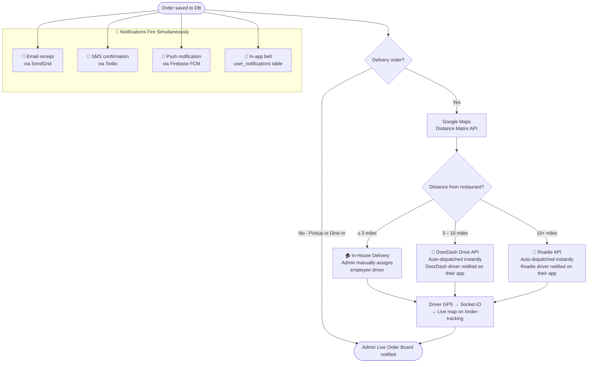
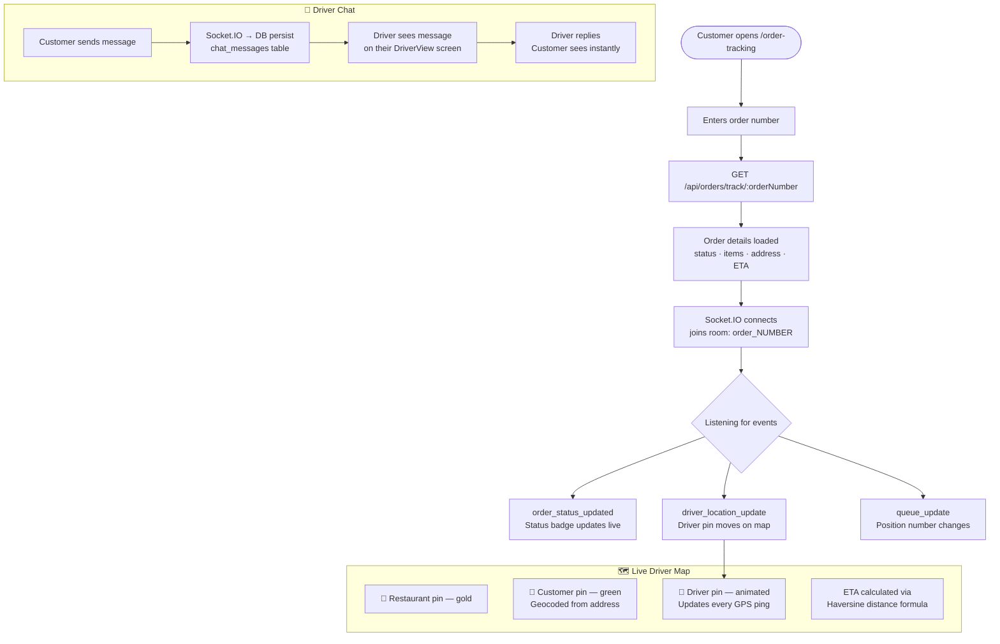
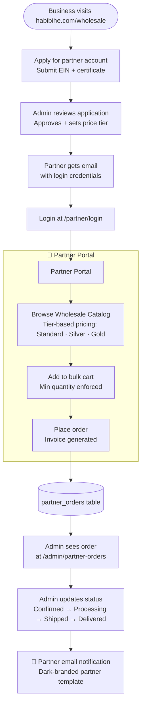
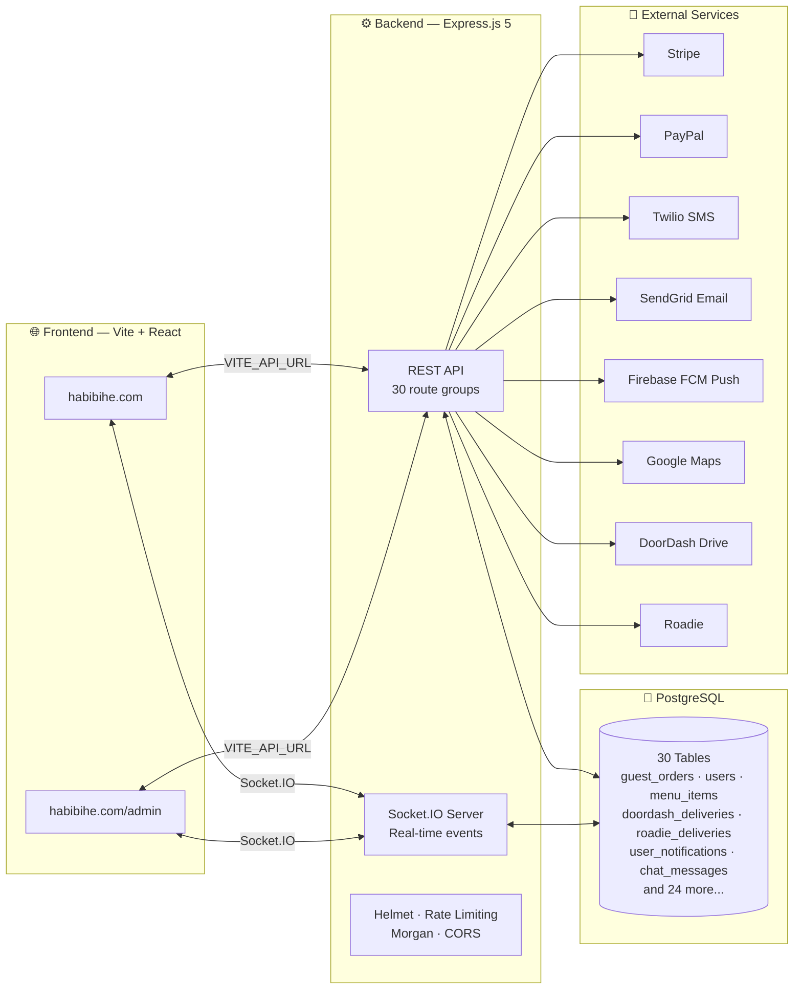

# Habibi Halal Express — System Flowchart

---

## 1. Customer Order Flow (Website)

```mermaid
flowchart TD
    A([👤 Customer visits habibihe.com]) --> B[Browse Menu\n172 items · 9 categories]
    B --> C[Add Items to Cart\nChoices · Add-ons · Qty · Special note]
    C --> D{Logged In?}
    D -->|Yes| E[Cart synced to DB\nLoyalty points shown]
    D -->|No| F[Guest cart in memory]
    E --> G[Checkout Page]
    F --> G

    G --> H{Order Type?}

    H -->|🚗 Delivery| I[Enter Address\nGoogle Maps autocomplete\nDelivery fee calculated live]
    H -->|🏃 Pickup| J[Select pickup time]
    H -->|🍽️ Dine-In| K[QR code scanned\nTable auto-assigned\nNo delivery fee]

    I --> L[Apply Coupon Code?\nLive validation · Discount applied]
    J --> L
    K --> L

    L --> M[Select Tip\n0% · 5% · 10% · 15% · 20%]
    M --> N{Payment Method?}

    N -->|💳 Card| O[Stripe Payment Element\nApple Pay · Google Pay included]
    N -->|🅿️ PayPal| P[PayPal SDK button\nServer-side capture]
    N -->|📲 Zelle / CashApp| Q[Offline modal shows\npayment handle · Customer confirms]
    N -->|💵 Cash| R[Pay on delivery]

    O --> S[Place Order →]
    P --> S
    Q --> S
    R --> S

    S --> T[(PostgreSQL\nguest_orders)]
    T --> U[✅ Order number generated\ne.g. HHE-20240524-8821]
    U --> V[Customer redirected to\n/order-confirmation]
    V --> W[/order-tracking]
```

---

## 2. After Order Is Placed



---

## 3. Admin & Kitchen Flow

```mermaid
flowchart TD
    A([New order arrives]) --> B

    subgraph ADMIN [" 🖥️ Admin CPanel — habibihe.com/admin "]
        B[🔴 PENDING\nLive Board shows order]
        B --> C[Admin clicks Accept\n→ SMS + Email + Push fires]
        C --> D[🟡 PREPARING\nKitchen gets the order]
        D --> E[Admin marks Ready\n→ SMS + Email + Push fires]
        E --> F{Delivery method?}
        F -->|Delivery| G[🚗 OUT FOR DELIVERY\nDriver dispatched or assigned]
        F -->|Pickup| H[✅ READY FOR PICKUP\nCustomer notified]
        F -->|Dine-In| I[✅ SERVED TO TABLE\nTable number shown]
        G --> J[Admin marks Delivered\n→ Final SMS + Email fires]
    end

    subgraph KITCHEN [" 👨‍🍳 Kitchen Display — /kitchen "]
        K[Auto-refreshes every 30 seconds]
        K --> L{Dine-In?}
        L -->|Yes| M[Shows table number\nStaff brings food]
        L -->|No| N[Shows order number\nPickup counter]
    end

    D --> K

    subgraph QUEUE [" 📊 Queue System "]
        O[/order-tracking shows\nX orders ahead of yours]
        O --> P[Socket.IO pushes\nqueue_update on every\nstatus change]
    end

    B --> O
```

---

## 4. Real-Time Order Tracking (Customer)



---

## 5. Marketplace Orders (Milestone 2)

```mermaid
flowchart TD
    subgraph PLATFORMS [" Customer orders through 3rd-party app "]
        A[🟠 UberEats App\nCustomer orders Habibi food]
        B[🔴 DoorDash App\nCustomer orders Habibi food]
        C[🟡 GrubHub App\nCustomer orders Habibi food]
    end

    A -->|Webhook POST| D[/api/marketplace/webhook/ubereats]
    B -->|Webhook POST| E[/api/marketplace/webhook/caviar]
    C -->|Webhook POST| F[/api/marketplace/webhook/grubhub]

    D --> G[Normalized to\nmarketplace_orders table]
    E --> G
    F --> G

    G --> H[Socket.IO emits\nmarketplace_order event]
    H --> I[Admin MarketplaceOrders page\nUberEats · DoorDash · GrubHub tabs]

    I --> J{Admin action}
    J -->|Accept| K[Order goes to kitchen]
    J -->|Decline| L[Platform notified · Customer refunded\nby the platform]

    K --> M[Platform handles delivery\nwith their own drivers\nHabibi never dispatches for these]

    style M fill:#166534,color:#fff
```

---

## 6. Partner / Wholesale Portal



---

## 7. Data & Infrastructure Layer



---

## Quick Reference — All API Routes

| Method | Route | What it does |
|---|---|---|
| POST | `/api/auth/register` | Create account + send verification email |
| POST | `/api/auth/login` | Login → JWT token |
| GET | `/api/auth/verify-email` | Verify email token → auto login |
| POST | `/api/auth/forgot-password` | Send reset link |
| POST | `/api/auth/reset-password` | Set new password |
| POST | `/api/orders/guest` | Place order (no auth needed) |
| GET | `/api/orders/track/:num` | Track any order by number |
| GET | `/api/orders/queue/:num` | Queue position |
| GET | `/api/orders/chat/:num` | Chat history |
| POST | `/api/payments/create-intent` | Stripe payment intent |
| POST | `/api/payments/paypal/capture` | Confirm PayPal payment |
| GET | `/api/menus` | All menu items + categories |
| POST | `/api/dispatch/calculate-fee` | Delivery fee from address |
| GET | `/api/users/me` | My profile |
| GET | `/api/users/me/notifications` | Notification inbox |
| GET | `/api/dine-in/tables/by-slug/:slug` | Table from QR code |
| GET | `/api/dine-in/kitchen` | Kitchen display data |
| GET | `/api/locations` | All restaurant locations |
| POST | `/api/coupons/validate` | Validate coupon code |
| GET | `/health` | DB ping for uptime monitors |
